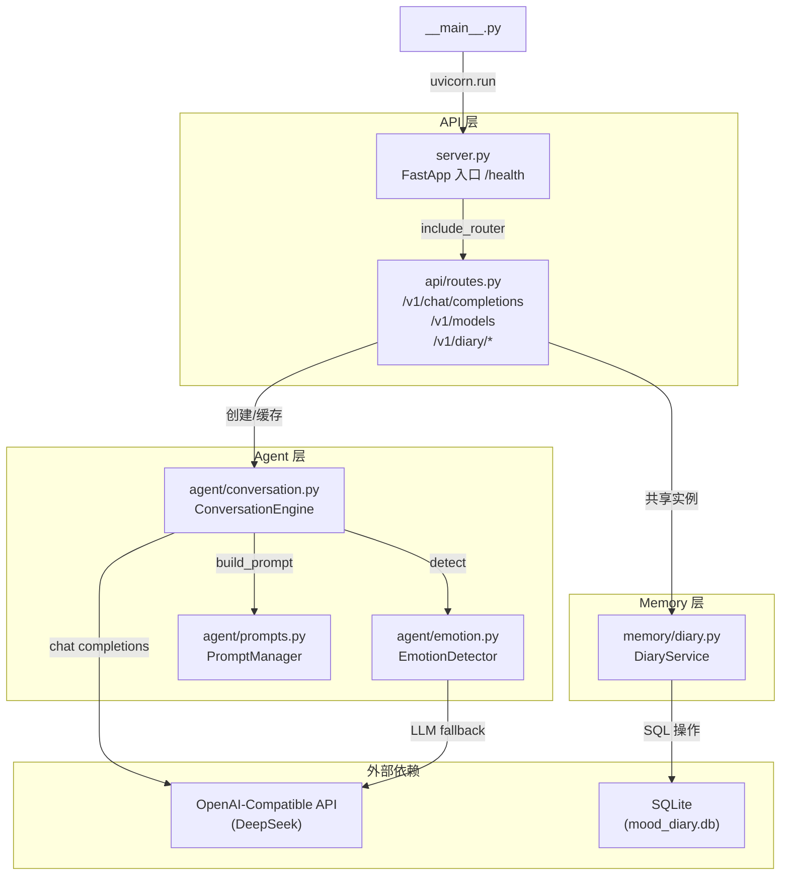

# Solacia — 全面评估报告

**项目**: solacia v0.1.0  
**路径**: `/tmp/solacia/`  
**评估日期**: 2026-05-29  
**评估范围**: 代码健康 + 安全审计 + 架构评估

---

## 总体评分

| 维度 | 评级 | 评分 |
|------|------|------|
| 代码质量 | GOOD | 7.5/10 |
| 安全性 | FAIR | 4/10 |
| 架构设计 | GOOD | 7/10 |
| 测试覆盖 | GOOD | 7/10 |
| **综合** | **GOOD** | **6.5/10** |

> 定位为 MVP 阶段项目，骨架干净，主要风险在运行时层面（安全 + 资源管理）。

---

## 一、代码健康扫描

### 1.1 Linting

**ruff 检查结果: 22 个问题（0 error, 22 style）**

| 规则 | 数量 | 文件 |
|------|------|------|
| E501 (行过长) | 21 | prompts.py(13), emotion.py(6), diary.py(2) |
| E741 (歧义变量名) | 1 | test_e2e.py L209 变量名 `l` |

**F 类（Pyflakes）和 C90 类（复杂度）: 零问题**

### 1.2 代码指标

| 指标 | 值 |
|------|---|
| 总行数 | 1,475 行 (16 个 .py 文件) |
| 源码行数 | ~844 行 (8 个模块) |
| 测试行数 | ~530 行 (test_api + test_e2e) |
| 测试/源码比 | 0.63:1 |
| 超 200 行文件 | 1 (routes.py, 196 行 — 临界) |
| 函数复杂度 | 无 C90 超标 |

### 1.3 反模式

| 问题 | 位置 | 严重度 |
|------|------|--------|
| broad except + 静默吞没 | emotion.py L137 | ⚠️ 中 |
| broad except + logger.error | conversation.py L65/L106/L156 | 低 |
| 硬编码凭据 | 未发现 | ✅ |
| TODO/FIXME | 未发现 | ✅ |
| type:ignore/noqa | 未发现 | ✅ |

### 1.4 依赖状态

- **所有运行时依赖版本最新**（fastapi, openai, uvicorn, pydantic, python-dotenv）
- **无安全漏洞报告**
- 仅 pip/setuptools 有小版本更新（非运行时）

### 1.5 导入健康

**无循环导入。** 依赖图呈清晰 DAG：

```
__main__ → config, uvicorn
server → api.routes
api.routes → agent.conversation, memory.diary
agent.conversation → config, agent.emotion, agent.prompts
agent.emotion → config, openai
memory.diary → config
config → dotenv (叶子节点)
```

---

## 二、安全审计 (OWASP Top 10)

### 发现汇总

| 严重度 | 数量 |
|--------|------|
| 🔴 Critical | 2 |
| 🟠 High | 4 |
| 🟡 Medium | 5 |
| 🟢 Low | 2 |
| **合计** | **13** |

### Critical (立即修复)

| # | OWASP | 问题 | 位置 |
|---|-------|------|------|
| 1 | A07 | **完全缺失认证** — 所有 API 端点零认证，任何人可读取情绪日记 | routes.py 全文 |
| 2 | A01 | **无数据隔离** — session_id 由客户端提供，可冒充；日记硬编码 "default" session | routes.py L48-50, L115-130 |

### High (短期修复)

| # | OWASP | 问题 | 位置 |
|---|-------|------|------|
| 3 | A03 | **LLM 提示注入** — 用户输入直接嵌入 prompt，无净化 | conversation.py L54, emotion.py L97 |
| 4 | A04 | **无速率限制** — 可暴力调用 LLM 产生费用 | 全局 |
| 5 | A04 | **无输入长度限制** — content 字段无 max_length | routes.py L36-40 |
| 6 | A05 | **绑定 0.0.0.0** — 默认暴露所有网络接口 | config.py L23 |

### Medium

| # | OWASP | 问题 |
|---|-------|------|
| 7 | A04 | 会话无 TTL/上限 → 内存泄漏 |
| 8 | A08 | LLM 输出无内容过滤 |
| 9 | A09 | 异常日志可能泄露 API Key |
| 10 | A06 | Dockerfile 以 root 运行 |
| 11 | A02 | LLM_API_KEY 默认空字符串，不报错 |

### Low（确认安全）

| # | OWASP | 结论 |
|---|-------|------|
| 12 | A03 | SQL 注入防护良好 ✅ (参数化查询) |
| 13 | A10 | SSRF 风险低 ✅ (base_url 来自配置) |

---

## 三、架构评估

### 3.1 架构图



### 3.2 架构优势

1. **三层职责清晰** — API / Agent / Memory 分离合理
2. **OpenAI 兼容接口** — 可被标准客户端直接对接
3. **情绪检测双通道** — 关键词快速路径 + LLM 慢速路径
4. **Prompt 多样性** — 随机选择引导语，避免回复模式固化
5. **配置外部化** — 符合 12-Factor 原则
6. **Docker 就绪** — Dockerfile + docker-compose 完整

### 3.3 架构风险

| 优先级 | 问题 | 位置 | 影响 |
|--------|------|------|------|
| P0 | 会话缓存无上限 | routes.py L21 | 长期运行 OOM |
| P0 | 无用户认证 | 全局 | 不可公开部署 |
| P0 | SQLite 单写者瓶颈 | diary.py | 高并发阻塞 |
| P1 | chat()/achat() 代码重复 | conversation.py | 维护成本翻倍 |
| P1 | PromptManager 冗余实例化 | prompts.py L68-71 | 每次 build_prompt 创建新 EmotionDetector |
| P1 | LLM 调用无重试/超时 | conversation.py | 网络抖动直接 fallback |
| P1 | usage 字段硬编码 0 | routes.py L87-91 | 客户端无法追踪 token 用量 |
| P2 | 情绪仅支持英文关键词 | emotion.py | 中文用户无法命中快速路径 |

### 3.4 测试覆盖矩阵

| 模块 | 单元测试 | 集成测试 | E2E | 未覆盖路径 |
|------|---------|---------|-----|-----------|
| server.py | — | ✅ | ✅ | — |
| api/routes.py | — | ✅ | ✅ | 并发隔离 |
| agent/conversation.py | — | 部分 | 部分 | LLM 失败 fallback、history 裁剪 |
| agent/emotion.py | ✅ 9 个 | — | — | _detect_by_llm() 慢速路径 |
| agent/prompts.py | — | — | — | build_prompt() 完整路径 |
| memory/diary.py | — | ✅ | ✅ | session_id 过滤、时间范围 |
| config.py | — | — | — | 环境变量加载 |

**关键缺口**: 无 LLM Mock 测试 → CI 离线时 chat 测试必然失败

---

## 四、优先修复建议

### P0 — 立即（MVP 可部署前必须）

| # | 修复 | 工作量 |
|---|------|--------|
| 1 | 会话缓存加 TTL + 容量上限（cachetools.TTLCache） | 小 |
| 2 | 输入长度限制（`Field(max_length=4000)`） | 小 |
| 3 | emotion.py L137 加 logger.warning | 小 |
| 4 | 生产环境绑定 127.0.0.1 | 小 |

### P1 — 短期（发布前）

| # | 修复 | 工作量 |
|---|------|--------|
| 5 | 添加 API Key 认证中间件 | 中 |
| 6 | 添加速率限制（slowapi） | 小 |
| 7 | 删除 sync chat() 方法 + sync OpenAI 客户端 | 小 |
| 8 | PromptManager 消除冗余实例化（EMOTIONS 直接查表） | 小 |
| 9 | LLM 调用添加重试 + 超时 | 小 |
| 10 | 添加 LLM Mock 测试 | 中 |

### P2 — 中期（演进方向）

| # | 改进 | 工作量 |
|---|------|--------|
| 11 | 会话持久化（SQLite/Redis） | 中 |
| 12 | 用户认证 + 数据隔离 | 大 |
| 13 | 中文情绪关键词 / jieba 分词 | 中 |
| 14 | 真实 token 计数（tiktoken） | 小 |
| 15 | 请求日志中间件 | 小 |
| 16 | Dockerfile 加固（非 root、依赖锁定） | 小 |

---

## 五、结论

Solacia 的架构骨架是干净的：三层划分合理，OpenAI 兼容接口设计正确，情绪检测双通道策略有效。1,475 行代码量精简，无循环导入，无硬编码凭据。

**主要风险集中在运行时层面**：
- 安全：零认证 + 零隔离 → 不可公开部署
- 稳定性：会话缓存无上限 → 长期运行 OOM
- 代码：chat/achat 重复 + PromptManager 冗余实例化

**好消息**：所有 P0 修复都是小工作量（改几行代码），不需要大规模重构。
