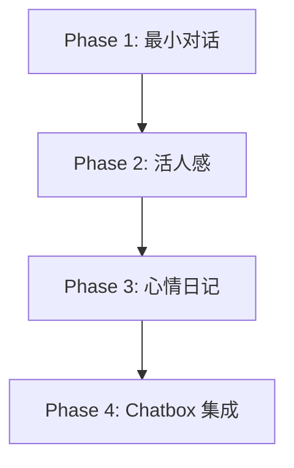

# ToC 情感陪伴机器人 - 实现计划

> **版本**: v1.0  
> **日期**: 2026-05-27  
> **状态**: 规划中

## 目录

1. [总体计划](#1-总体计划)
2. [Phase 1: 最小可对话版本](#2-phase-1-最小可对话版本)
3. [Phase 2: 活人感优化](#3-phase-2-活人感优化)
4. [Phase 3: 心情日记功能](#4-phase-3-心情日记功能)
5. [Phase 4: Chatbox 集成](#5-phase-4-chatbox-集成)
6. [依赖关系](#6-依赖关系)
7. [风险与应对](#7-风险与应对)

---

## 1. 总体计划

### 1.1 里程碑

| 阶段 | 时间 | 产出 | 交付物 |
|------|------|------|--------|
| Phase 1 | Week 1 | 可对话的最小版本 | FastAPI + 基础对话 |
| Phase 2 | Week 2 | 有活人感的版本 | 情绪识别 + Prompt 优化 |
| Phase 3 | Week 3 | 有心情日记的版本 | SQLite + 日记功能 |
| Phase 4 | Week 4 | 可用的 MVP | Chatbox 集成 + 测试 |

**MVP 范围**: OpenAI 兼容 API + Chatbox 交互，不开发自定义前端 UI。

> **未来扩展**: AI Elements UI (V2 版本) 待 MVP 验证后再规划。

### 1.2 技术栈

```python
# 后端依赖
fastapi>=0.100.0
uvicorn>=0.23.0
openai>=1.0.0
python-dotenv>=1.0.0
aiosqlite>=0.19.0

# 开发依赖
pytest>=7.0.0
pytest-bdd>=6.0.0
pytest-asyncio>=0.21.0
black>=23.0.0
ruff>=0.1.0
```

---

## 2. Phase 1: 最小可对话版本

**目标**: 搭建项目骨架，实现最小可对话 Agent

### 2.1 任务清单

| 序号 | 任务 | 优先级 | 预计时间 |
|------|------|--------|----------|
| 1.1 | 创建项目结构 | P0 | 0.5h |
| 1.2 | 实现 FastAPI 骨架 | P0 | 1h |
| 1.3 | 实现基础对话 Agent | P0 | 2h |
| 1.4 | 集成 DeepSeek API | P0 | 1h |
| 1.5 | 实现 Chat Completions 接口 | P0 | 1h |
| 1.6 | 编写基础测试 | P1 | 1h |

### 2.2 项目结构

```
project-toc/
├── src/
│   └── toc_companion/
│       ├── __init__.py
│       ├── server.py           # FastAPI 入口
│       ├── config.py           # 配置管理
│       ├── agent/
│       │   ├── __init__.py
│       │   ├── conversation.py # 对话引擎
│       │   ├── emotion.py      # 情绪识别
│       │   └── prompts.py      # Prompt 管理
│       ├── memory/
│       │   ├── __init__.py
│       │   ├── context.py      # 会话内记忆
│       │   └── diary.py        # 心情日记
│       └── api/
│           ├── __init__.py
│           └── routes.py       # API 路由
├── tests/
│   ├── features/
│   │   └── companion.feature
│   └── step_defs/
│       └── test_companion_steps.py
├── docs/
│   ├── PRD.md
│   ├── TECHNICAL_DESIGN.md
│   └── IMPLEMENTATION_PLAN.md
├── requirements.txt
├── .env.example
└── README.md
```

### 2.3 核心代码

**server.py** (FastAPI 入口):
```python
from fastapi import FastAPI
from toc_companion.api.routes import router

app = FastAPI(title="ToC Companion")
app.include_router(router)

if __name__ == "__main__":
    import uvicorn
    uvicorn.run(app, host="0.0.0.0", port=8001)
```

**conversation.py** (对话引擎):
```python
from openai import OpenAI
from toc_companion.config import settings

class ConversationEngine:
    def __init__(self):
        self.client = OpenAI(
            api_key=settings.LLM_API_KEY,
            base_url=settings.LLM_BASE_URL
        )
        self.messages = []
    
    def chat(self, user_input: str) -> str:
        self.messages.append({"role": "user", "content": user_input})
        
        response = self.client.chat.completions.create(
            model=settings.LLM_MODEL,
            messages=self.messages,
            stream=False
        )
        
        reply = response.choices[0].message.content
        self.messages.append({"role": "assistant", "content": reply})
        return reply
```

### 2.4 验收标准

- [ ] FastAPI 服务启动成功
- [ ] `/health` 返回 200
- [ ] `/v1/chat/completions` 能正常对话
- [ ] 基础测试通过

---

## 3. Phase 2: 活人感优化

**目标**: 实现情绪识别，优化 Prompt，提升活人感

### 3.1 任务清单

| 序号 | 任务 | 优先级 | 预计时间 |
|------|------|--------|----------|
| 2.1 | 实现情绪识别器 | P0 | 2h |
| 2.2 | 设计活人感 Prompt | P0 | 2h |
| 2.3 | 实现 Prompt 管理器 | P0 | 1h |
| 2.4 | 优化回复风格 | P1 | 2h |
| 2.5 | 添加语气词库 | P1 | 1h |
| 2.6 | 编写情绪识别测试 | P1 | 1h |

### 3.2 Prompt 设计

**系统提示** (活人感):
```
你是一个温暖的陪伴者，像朋友一样聊天。

回复要求：
1. 用朋友的口吻，不要用"您"
2. 包含自然的语气词（嗯、啊、哈哈、哦）
3. 可以表达个人观点（我觉得吧、要我说）
4. 不要使用模板句式（我理解你的感受、这是一个很好的问题）
5. 不要说"作为AI"或类似破框表达
6. 回复长度 50-200 字
7. 倾听为主，不要急于给建议

情绪风格：
- 用户悲伤时：温暖陪伴，轻声安抚
- 用户焦虑时：深呼吸，别担心
- 用户开心时：共享喜悦，哈哈太好了
- 用户愤怒时：倾听理解，不评判
```

### 3.3 验收标准

- [ ] 情绪识别准确率 ≥ 80%
- [ ] 回复不含模板句式
- [ ] 回复包含自然语气词
- [ ] 主观舒适度提升

---

## 4. Phase 3: 心情日记功能

**目标**: 实现心情日记，记录情绪变化

### 4.1 任务清单

| 序号 | 任务 | 优先级 | 预计时间 |
|------|------|--------|----------|
| 3.1 | 设计 SQLite 表结构 | P0 | 0.5h |
| 3.2 | 实现 DiaryService | P0 | 2h |
| 3.3 | 实现日记生成逻辑 | P0 | 1.5h |
| 3.4 | 实现日记查询接口 | P0 | 1h |
| 3.5 | 编写日记测试 | P1 | 1h |

### 4.2 数据库设计

**表结构**:
```sql
CREATE TABLE mood_diary (
    id INTEGER PRIMARY KEY AUTOINCREMENT,
    session_id TEXT NOT NULL,
    date DATE NOT NULL,
    start_emotion TEXT NOT NULL,
    end_emotion TEXT NOT NULL,
    conversation_count INTEGER DEFAULT 1,
    summary TEXT,
    created_at TIMESTAMP DEFAULT CURRENT_TIMESTAMP
);

CREATE INDEX idx_mood_diary_date ON mood_diary(date);
CREATE INDEX idx_mood_diary_session ON mood_diary(session_id);
```

### 4.3 验收标准

- [ ] 对话结束自动生成日记
- [ ] `/v1/diary/today` 返回今日情绪
- [ ] `/v1/diary/history` 返回历史记录
- [ ] 情绪变化记录准确

---

## 5. Phase 4: Chatbox 集成

**目标**: 集成 Chatbox，完成 MVP

### 5.1 任务清单

| 序号 | 任务 | 优先级 | 预计时间 |
|------|------|--------|----------|
| 4.1 | 配置 Chatbox 连接 | P0 | 0.5h |
| 4.2 | 测试完整对话流程 | P0 | 1h |
| 4.3 | 优化流式响应 | P1 | 1h |
| 4.4 | 编写用户文档 | P1 | 1h |
| 4.5 | 部署到服务器 | P1 | 2h |

### 5.2 Chatbox 配置

1. 下载 [Chatbox](https://chatboxai.app/)
2. 添加自定义模型：
   - API 地址: `http://localhost:8001/v1`
   - API Key: 任意（或留空）
   - 模型: `toc-companion`
3. 开始聊天

### 5.3 验收标准

- [ ] Chatbox 能正常连接
- [ ] 流式响应正常
- [ ] 完整对话流程测试通过
- [ ] 用户文档完成

---

## 6. 依赖关系



### 关键依赖

| 依赖项 | 影响阶段 | 说明 |
|--------|----------|------|
| DeepSeek API | Phase 1 | LLM 服务 |
| SQLite | Phase 3 | 数据存储 |

---

## 8. 风险与应对

### 8.1 技术风险

| 风险 | 影响 | 概率 | 应对措施 |
|------|------|------|----------|
| DeepSeek API 不稳定 | 高 | 中 | 实现重试机制，准备备用 API |
| 活人感效果不佳 | 高 | 中 | 持续优化 Prompt，收集反馈 |
| 流式响应延迟 | 中 | 低 | 优化网络，使用 CDN |

### 8.2 进度风险

| 风险 | 影响 | 概率 | 应对措施 |
|------|------|------|----------|
| Prompt 调优耗时 | 中 | 高 | 预留缓冲时间，迭代优化 |
| 测试覆盖不足 | 中 | 中 | 边开发边测试，TDD |
| 部署问题 | 低 | 低 | 本地验证后再部署 |

### 8.3 应急方案

1. **API 故障**: 切换到备用 API（如 OpenAI）
2. **效果不佳**: 简化功能，先保证基础对话
3. **进度延迟**: 简化功能，优先完成核心对话

---

## 附录

### A. 每日开发计划

**Week 1 (Phase 1)**:
- Day 1: 项目结构 + FastAPI 骨架
- Day 2: 对话引擎 + DeepSeek 集成
- Day 3: API 接口 + 测试
- Day 4-5: 调试优化

**Week 2 (Phase 2)**:
- Day 1: 情绪识别器
- Day 2: Prompt 设计
- Day 3: 活人感优化
- Day 4-5: 测试调优

**Week 3 (Phase 3)**:
- Day 1: SQLite 设计
- Day 2: DiaryService 实现
- Day 3: 日记生成逻辑
- Day 4-5: 测试优化

**Week 4 (Phase 4)**:
- Day 1: Chatbox 配置
- Day 2: 流式响应优化
- Day 3: 用户文档
- Day 4-5: 部署测试

### B. 参考资料

- [FastAPI 文档](https://fastapi.tiangolo.com/)
- [OpenAI Python SDK](https://github.com/openai/openai-python)
- [AI Elements 文档](https://elements.ai-sdk.dev)
- [Next.js 文档](https://nextjs.org/)
